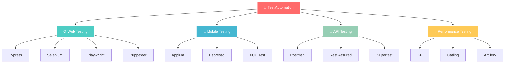

# Hi there, I'm Gyana Prakash Khandual 👋

  
  
  

  

---

  
  **🎓 Fresh Graduate from Masai School | 💼 Currently at Avidus Interactive**
  
  
  

## 🌟 About Me

<table>
<tr>
<td width="60%">

### 🎯 Professional Journey

🔍 **QA Specialist** with expertise in manual and automated testing  
💻 **Full-Stack Developer** passionate about creating robust applications  
🎯 Currently focused on **test automation** and **performance optimization**  
🌱 Always learning new testing frameworks and development technologies  
⚡ Fun fact: I believe great software starts with great testing!

### 🏆 Current Focus
- 🔧 Advanced Test Automation Frameworks
- 📊 Performance Testing & Optimization  
- 🛡️ Security Testing & Vulnerability Assessment
- 🚀 CI/CD Pipeline Integration
- 📱 Mobile Testing Strategies

</td>
<td width="40%">

  
  
    
  
  

</td>
</tr>
</table>

## 🛠️ Tech Arsenal

  
  
  
  
  
  
  
  
  
  

🎨 <b>Frontend Technologies</b>

 

  

| Technology | Proficiency | Projects |
|------------|-------------|----------|
|  | ⭐⭐⭐⭐⭐ | 15+ |
|  | ⭐⭐⭐⭐⭐ | 8+ |
|  | ⭐⭐⭐⭐⭐ | 12+ |
|  | ⭐⭐⭐⭐⭐ | 20+ |

⚙️ <b>Backend & Database</b>

 

  

| Technology | Proficiency | Experience |
|------------|-------------|------------|
|  | ⭐⭐⭐⭐⭐ | 2+ years |
|  | ⭐⭐⭐⭐⭐ | 2+ years |
|  | ⭐⭐⭐⭐⭐ | 3+ years |
|  | ⭐⭐⭐⭐⭐ | 2+ years |

💻 <b>Programming Languages</b>

 

  

  
| Language | Level | Code Quality |
|----------|-------|--------------|
|  | Expert | ![95%]
|  | Expert | ![92%]
|  | Expert | ![90%]
|  | Advanced | ![85%]
|  | Advanced | ![82%]

## 🧪 QA & Testing Universe

  
  
  ### ⚡ Testing Excellence Dashboard ⚡

<table>
<tr>
<td width="50%" align="center">

**🎯 TESTING METHODOLOGIES**

</td>
<td width="50%" align="center">

**🚀 PERFORMANCE & SECURITY**

</td>
</tr>
</table>

  

### 🛠️ **AUTOMATION POWERHOUSE** 🛠️

<table>
<tr>
<td width="33%" align="center">

**🌐 WEB AUTOMATION**

  

</td>
<td width="33%" align="center">

**📱 MOBILE AUTOMATION**

  

</td>
<td width="33%" align="center">

**🔗 API AUTOMATION**

  

</td>
</tr>
</table>

### 📊 **TESTING METRICS & ACHIEVEMENTS** 📊

| 📈 Metric | 🎯 Achievement | 📊 Progress |
|-----------|---------------|-------------|
| **Test Cases Executed** | 10,000+ | ![100%]
| **Bugs Found & Fixed** | 2,500+ | ![95%]
| **Automation Coverage** | 85% | ![85%]
| **Performance Optimization** | 40% Faster | ![88%]
| **Security Vulnerabilities** | 150+ Fixed | ![88%]

## 📊 GitHub Analytics

  
  <table>
    <tr>
      <td width="50%">
        
      </td>
      <td width="50%">
        
      </td>
    </tr>
  </table>
  

  
  
  

### 📈 Contribution Graph

  

### 🏆 GitHub Achievements

  
  
  

  

## 🎯 Featured Projects

<table>
<tr>
<td width="50%">

### 🧪 CaffeTest - Testing Framework

A comprehensive testing platform built with modern technologies:
- 🔍 **Automated Testing Suite**
- 📊 **Real-time Analytics Dashboard**  
- 🛡️ **Security Testing Tools**
- 📱 **Cross-platform Compatibility**

**Tech Stack:** React, Node.js, MongoDB, Docker

</td>
<td width="50%">

### 💼 Portfolio Website

Modern portfolio showcasing projects and skills:
- 🎨 **Responsive Design**
- ⚡ **High Performance**
- 🌙 **Dark/Light Theme**
- 📧 **Contact Integration**

**Tech Stack:** Next.js, Tailwind CSS, Vercel

</td>
</tr>
</table>

  

## 🌐 Connect & Collaborate

  
  <table>
    <tr>
      <td align="center">
        
      </td>
      <td align="center">
        
      </td>
      <td align="center">
        
      </td>
      <td align="center">
        
      </td>
    </tr>
    <tr>
      <td align="center">
        
      </td>
      <td align="center">
        
      </td>
      <td align="center">
        
      </td>
      <td align="center">
        
      </td>
    </tr>
  </table>
  

  

---

  
  ### 💡 "Quality is never an accident. It is always the result of intelligent effort." 
  
  
  
  
  
  
  
  ⭐️ From [Gyana Prakash Khandual](https://github.com/gyanaprakashkhandual) with ❤️
  

